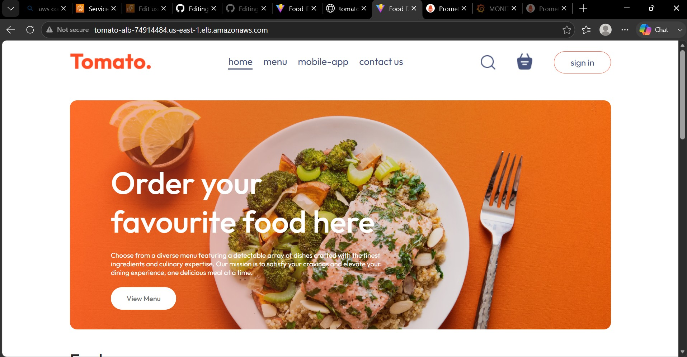
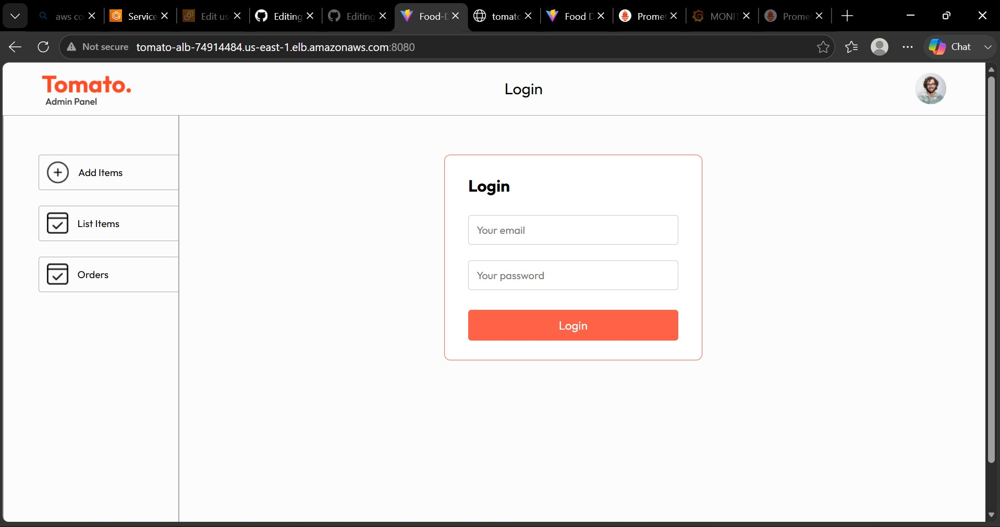
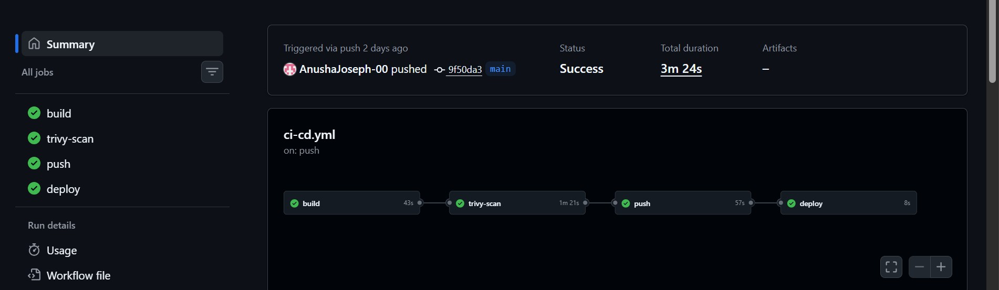
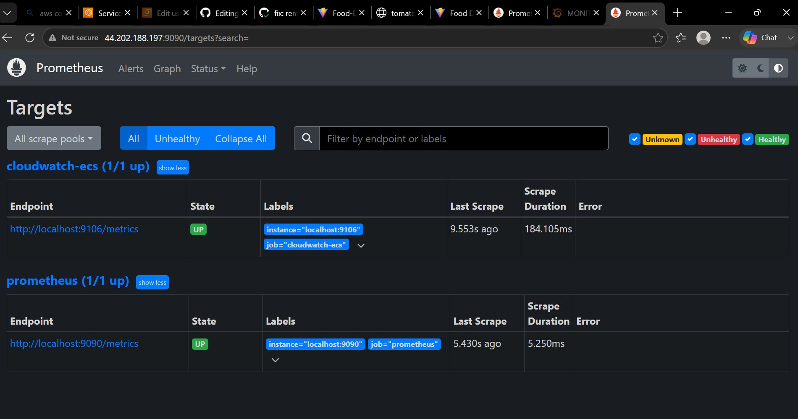
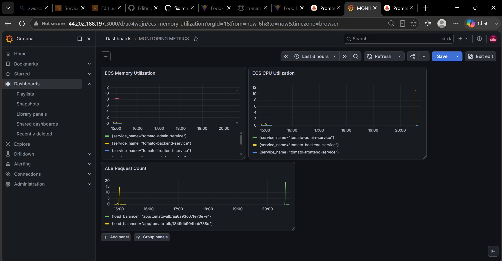
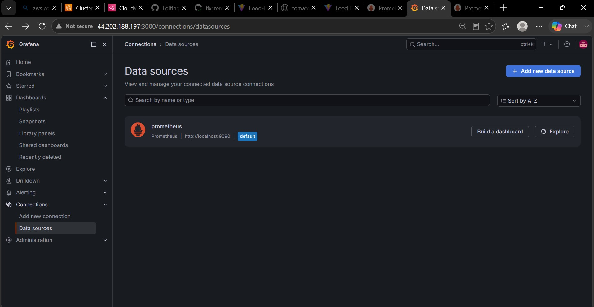
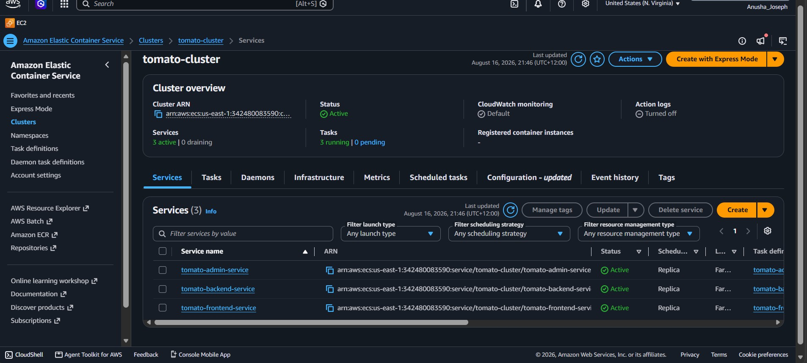
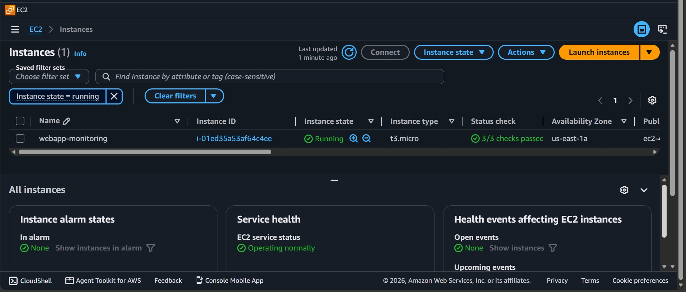
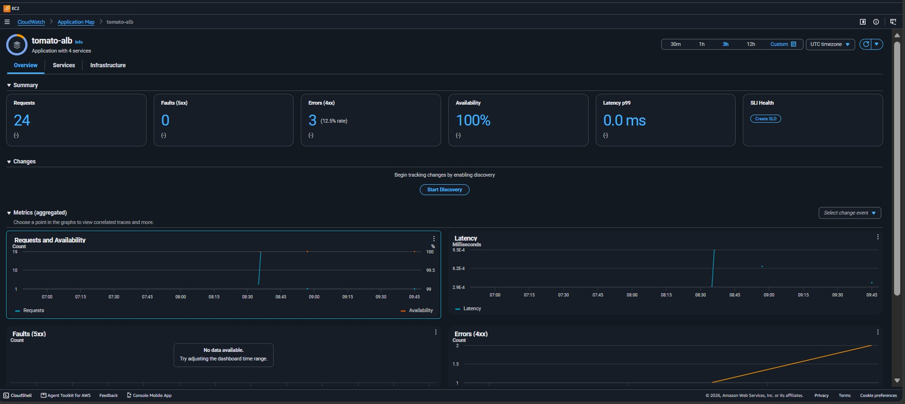

# AWS Monitoring with Prometheus and Grafana

An observability stack built on top of a MERN food delivery app (https://github.com/AnushaJoseph-00/food-delivery-app-cicd-terraform) deployed on AWS ECS Fargate using Terraform. Scrapes ECS CPU, memory and ALB request metrics from AWS CloudWatch via Prometheus and visualises them in Grafana dashboards.

## Architecture

## Stack

| Tool | Purpose |
|---|---|
| AWS ECS Fargate | Runs frontend, backend, admin containers |
| AWS CloudWatch | Collects ECS and ALB metrics automatically |
| CloudWatch Exporter | Converts CloudWatch metrics to Prometheus format |
| Prometheus | Scrapes and stores time series metrics |
| Grafana | Visualizes metrics as dashboards |
| EC2 t3.micro | Hosts Prometheus, Grafana, CloudWatch Exporter |
| Terraform | Provisions ECS, ALB, VPC, ECR, IAM infrastructure |
| GitHub Actions | CI/CD pipeline - build, scan, push, deploy |

## Prerequisites

- AWS account
- MongoDB Atlas cluster (permanent database user, IP access `0.0.0.0/0`)
- GitHub Actions secrets:
  - `AWS_ACCESS_KEY_ID`
  - `AWS_SECRET_ACCESS_KEY`
  - `AWS_ACCOUNT_ID`
---

## EC2 Setup

Launch a t3.micro instance (Amazon Linux 2023) with the following settings:

- IAM instance profile: attach role with `CloudWatchReadOnlyAccess`
- Security group inbound rules:

| Port | Protocol | Source |
|---|---|---|
| 22 | TCP | My IP |
| 3000 | TCP | My IP |
| 9090 | TCP | My IP |
| 9106 | TCP | My IP |

- Paste the `user-data.sh` from the repo file in **Advanced details → User data**

The script automatically installs and starts all three services on boot
- Prometheus on port 9090
- Grafana on port 3000
- CloudWatch Exporter on port 9106

No manual setup is required.

---

## Verifying the Setup

SSH into the instance:

```bash
ssh -i "your-key.pem" ec2-user@<EC2-PUBLIC-IP>
```

Check whether all services are running:

```bash
sudo systemctl status prometheus
sudo systemctl status grafana-server
sudo systemctl status cloudwatch_exporter
```

---

## Connect Grafana to Prometheus

Open Grafana at `http://<EC2-IP>:3000` 

---

## Verify Prometheus Targets

Open `http://<EC2-IP>:9090/targets`

Both targets should show UP:

| Job | Target | Status |
|---|---|---|
| cloudwatch-ecs | localhost:9106 | UP |
| prometheus | localhost:9090 | UP |

---

## CI/CD Pipeline

4-stage GitHub Actions pipeline:

| Stage | Description |
|---|---|
| Build | Docker images built for frontend, backend, admin |
| Scan | Trivy security scan for vulnerabilities |
| Push | Images pushed to Amazon ECR |
| Deploy | ECS force-new-deployment triggered |

---

## Infrastructure (Terraform)

Resources provisioned:

- VPC with public subnets across 2 availability zones
- ECS Fargate cluster with 3 services (frontend, backend, admin)
- Application Load Balancer with listeners on ports 80, 4000, 8080
- ECR repositories for Docker images
- IAM roles for ECS task execution and EC2 CloudWatch access
- CloudWatch log groups for container logs

---

## 📸 Screenshots

### Application
| Frontend | Admin Panel |
|---|---|
|  |  |

### CI/CD Pipeline


### Monitoring
| Prometheus Targets | Grafana Dashboard |
|---|---|
|  |  |

| Grafana Datasource | |
|---|---|
|  | |

### AWS Infrastructure
| ECS Services | EC2 Monitoring Instance |
|---|---|
|  |  |

| CloudWatch Logs | |
|---|---|
|  | |

## Related Repository

This repository is **Phase 2** of the Food Delivery App project, adding observability and monitoring on top of the existing infrastructure.

| Phase | Repository | Description |
|---|---|---|
| Phase 1 | [food-delivery-app-cicd-terraform](https://github.com/AnushaJoseph-00/food-delivery-app-cicd-terraform) | MERN stack app with Docker, Terraform, GitHub Actions CI/CD, ECS Fargate |
| Phase 2 | This repository | Prometheus + Grafana monitoring stack on EC2 with CloudWatch metrics |

---
## Credits

This project uses the [Tomato - Food Delivery App](https://github.com/Mshandev/Food-Delivery) originally built by [Muhammad Shan](https://github.com/Mshandev).

The original application was used as the base for demonstrating DevOps and observability practices including:

- Containerisation with Docker
- Infrastructure as Code with Terraform
- CI/CD automation with GitHub Actions
- Security scanning with Trivy
- Deployment to AWS ECS Fargate
- Monitoring with Prometheus and Grafana
- AWS CloudWatch metrics collection

---


